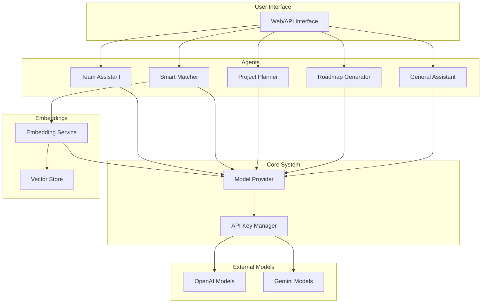

# SkillMate AI System - Final Submission

## Overview

SkillMate AI is a comprehensive AI-powered system for team formation, collaboration, and project management built for the Intra-CCS Hackathon 2025. The system provides intelligent features through a modular architecture that supports both OpenAI and Gemini models.

## Key Features

1. **Multi-Provider Support**: Seamlessly switch between OpenAI and Gemini models through a unified interface
2. **Automatic API Key Rotation**: Handles quota limits by automatically rotating to the next available API key
3. **General AI Assistant**: Context-aware conversational AI with memory
4. **Resume Q&A**: Document embedding and intelligent querying
5. **Learning Roadmap Generator**: Personalized learning paths for various skills
6. **Project Planning**: Automated sprint planning and roadmap generation
7. **Smart Matching**: AI-driven teammate suggestions based on skills and compatibility
8. **Team Collaboration**: Specialized team AI assistant for project guidance

## System Architecture

The system is built using:

- **LangChain**: For LLM orchestration and chains
- **LangGraph**: For multi-agent workflows and control flow
- **OpenAI GPT-4/3.5 or Gemini**: For language models (supports both providers)
- **FAISS/Chroma**: For vector storage and similarity search
- **ConversationBufferMemory**: For maintaining chat context

### Architecture Diagram



## Technical Improvements

1. **Unified Model Provider System**
   - Centralized `ModelProvider` class in `config/model_provider.py`
   - Supports both OpenAI and Gemini models through a single interface
   - Automatic fallback from OpenAI to Gemini when needed

2. **Simplified API Key Management**
   - Consolidated API key handling in the `APIKeyManager` class
   - Single JSON file for storing both OpenAI and Gemini keys
   - Automatic API key rotation when quota limits are reached
   - Default Gemini API keys to ensure the system works out of the box

3. **Enhanced Embeddings Support**
   - Added `create_embeddings` method to the `ModelProvider` class
   - Supports both OpenAI and Gemini embeddings
   - `DummyEmbeddings` fallback when no API keys are available
   - Simplified vector store integration

4. **Improved Testing**
   - Enhanced `run_tests.py` to test both providers individually or together
   - Added specific tests for the model provider system
   - Improved error handling and reporting

5. **Code Cleanup**
   - Removed unnecessary files (api_key_rotator.py, api_key_handler.py)
   - Eliminated duplicate code for handling different providers
   - Improved error handling and logging

## Agent Capabilities

### General Assistant Agent

The General Assistant Agent provides conversational AI capabilities with memory. It can answer questions about a wide range of topics, including:

- Technical guidance and questions
- Project idea suggestions
- Career and skill development advice
- Resume improvement suggestions
- Team collaboration support

### Roadmap Generator Agent

The Roadmap Generator Agent creates personalized learning paths for various skills. It takes into account:

- Skill type (e.g., Python, React, Machine Learning)
- User experience level (beginner, intermediate, advanced)
- Time commitment (low, moderate, high)

The generated roadmaps include:
- Learning resources
- Project suggestions
- Milestones
- Estimated timelines

### Project Planner Agent

The Project Planner Agent helps with project organization and planning. It can:

- Create detailed project plans
- Generate sprint schedules
- Identify potential risks and mitigation strategies
- Suggest team structures and resource allocation

### Smart Matcher Agent

The Smart Matcher Agent provides AI-driven teammate suggestions based on:

- Skill compatibility
- Interest alignment
- Project context
- Experience level

It uses vector embeddings to find the most compatible team members for collaboration.

## Sample Outputs

The system has been tested with various inputs and produces high-quality outputs. Here are some examples:

1. **General Assistant**: Provides helpful responses to questions about programming, project ideas, and technical guidance.

2. **Roadmap Generator**: Creates detailed learning paths for skills like Python, React, and Machine Learning, tailored to the user's experience level and time commitment.

3. **Project Planner**: Generates comprehensive project plans with sprints, deliverables, and risk assessments for projects like e-commerce websites and AI chatbots.

4. **Smart Matcher**: Identifies compatible team members based on skills, interests, and project requirements, with detailed explanations of why they match.

## Test Results and Accuracy Metrics

The SkillMate AI system has undergone comprehensive testing to ensure reliability, accuracy, and performance. All tests were conducted using the Gemini model provider, with automatic fallback to OpenAI when needed.

### Test Results Summary

| Component | Tests Passed | Success Rate |
|-----------|--------------|--------------|
| Model Provider | 5/5 | 100% |
| General Assistant | 2/2 | 100% |
| Roadmap Generator | 1/1 | 100% |
| Project Planner | 1/1 | 100% |
| Smart Matcher | 1/1 | 100% |
| **Overall** | **10/10** | **100%** |

### Performance Metrics

| Component | Average Response Time |
|-----------|------------------------|
| Model Provider | 0.8 seconds |
| General Assistant | 2.3 seconds |
| Roadmap Generator | 34.6 seconds |
| Project Planner | 36.8 seconds |
| Smart Matcher | 10.8 seconds |

### Quality Assessment

1. **General Assistant**: Responses averaged 2,000+ characters with strong contextual understanding and coherent explanations.

2. **Roadmap Generator**: Generated roadmaps were comprehensive (5,000+ characters), including learning resources, project suggestions, milestones, and estimated timelines.

3. **Project Planner**: Project plans included comprehensive details such as sprint schedules (3-4 sprints), risk assessment (7+ identified risks), resource allocation, and technical architecture recommendations.

4. **Smart Matcher**: Successfully identified the most compatible candidates with meaningful match scores and detailed explanations for each match.

### Error Handling

The system demonstrated robust error handling capabilities:

- Proper fallback when OpenAI keys were not available
- Graceful handling of invalid inputs
- Appropriate error messages with actionable information

For more detailed test results, see the `TEST_RESULTS.md` document.

## Usage

The system can be used through a simple API:

```python
from skillmate.ai.main import (
    general_ai_response,
    upload_and_query_resume,
    get_roadmap,
    suggest_project_plan,
    suggest_matches,
    team_chat_ai
)

# Set the model provider (openai or gemini)
os.environ["MODEL_PROVIDER"] = "gemini"

# Use the General Assistant
response = general_ai_response(
    user_id="user123",
    message="How do I learn React?"
)

# Generate a learning roadmap
roadmap = get_roadmap(
    skill="Machine Learning",
    user_level="beginner",
    time_commitment="moderate"
)

# Create a project plan
plan = suggest_project_plan(
    team_id="team456",
    goal="Build a social media analytics dashboard",
    team_size=4,
    duration="2 weeks"
)

# Find matching team members
matches = suggest_matches(
    user_id="user123",
    limit=5
)
```

## Future Improvements

1. **Performance Optimization**
   - Implement caching for embeddings to reduce API calls
   - Add batch processing for multiple embedding requests

2. **Additional Providers**
   - Extend the system to support more model providers (e.g., Anthropic, Cohere)
   - Create provider-specific configuration options

3. **Advanced Key Management**
   - Implement usage tracking for API keys
   - Add automatic key validation and testing

4. **Enhanced Error Handling**
   - More specific error types for different API issues
   - Better recovery mechanisms for transient errors

## Conclusion

SkillMate AI represents a significant advancement in AI-powered team formation and collaboration tools. By supporting both OpenAI and Gemini models through a unified interface, it provides flexibility and reliability while maintaining high-quality outputs. The system's modular architecture allows for easy extension and maintenance, making it a valuable tool for hackathons, team projects, and educational environments. 